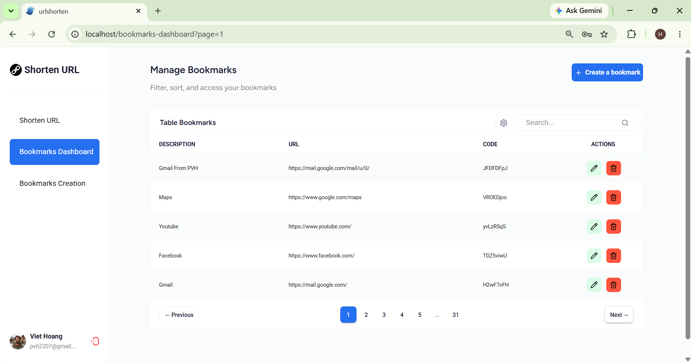
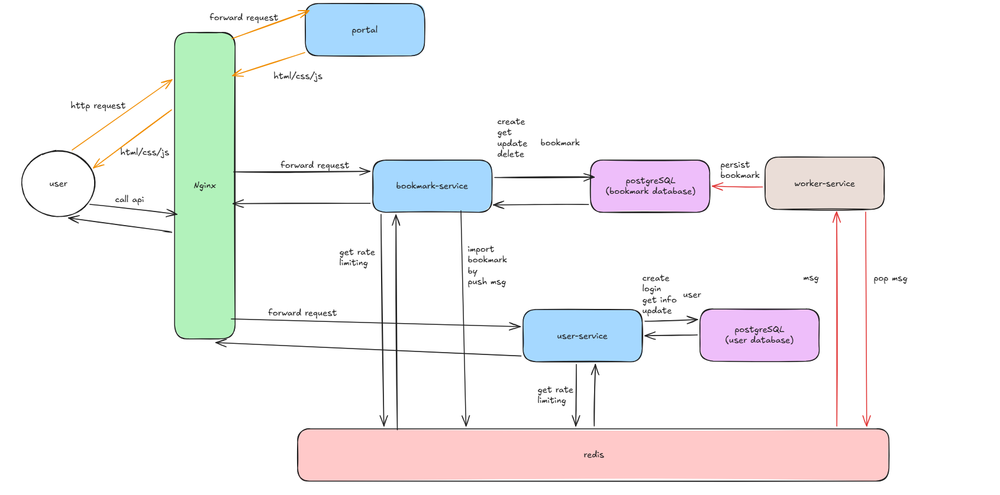

# shorten-url-deployment

Deployment and infrastructure configuration for the Shorten URL platform.

This repository provides the Docker Compose setup, Nginx reverse proxy, environment configuration, database initialization, and CI/CD workflows required to deploy and run the complete Shorten URL system.

The platform consists of a React frontend, authentication and user management service, bookmark and URL shortening service, background worker, PostgreSQL, Redis, and Nginx. All services are connected through a shared Docker network, while Nginx acts as the single public entry point and routes incoming requests to the appropriate service.

## Demo

[](https://youtu.be/979ioAqtwKA)

## Architecture 



```
                    ┌──────────────────────────────────────────────────────┐
                    │                  Internet / Client                   │
                    └──────────────────────┬───────────────────────────────┘
                                           │ :80
                    ┌──────────────────────▼───────────────────────────────┐
                    │                     nginx                            │
                    │              (Reverse Proxy / Router)                │
                    │                                                      │
                    │  /                        → portal (frontend)        │
                    │  /api/bookmark_service/*  → bookmark-service         │
                    │  /api/user_service/*      → user-service             │
                    └───┬───────────────┬───────────────┬──────────────────┘
                        │               │               │               
            ┌───────────▼──┐  ┌─────────▼──────┐   ┌────▼──────────────┐  
            │    portal    │  │  user-service  │   │ bookmark-service  │  
            │  (Frontend)  │  │    :8080       │   │    :8080          │  
            │    :3000     │  │                │   │                   │  
            │              │  │ - Register     │   │ - Shorten URL     │  
            │              │  │ - Login / JWT  │   │ - Redirect        │ 
            │              │  │ - Update Info  │   │ - CRUD bookmarks  │  
            │              │  │ - Self Info    │   │ - Import bookmarks│  
            └──────────────┘  └───────┬────────┘   └────────┬──────────┘  
                                      │                     │           
             ┌───────────────┐        │                     │
             │worker-service │        │                     │           
             │  (no port)    │        │                     │                
             │               │        │                     │                
             │ - Pop Redis   │        │                     │                
             │   queue       │        │                     │               
             │ - 4 workers   │        │                     │                
             │ - Insert DB   │        │                     │                
             │ - Invalidate  │        │                     │                
             │   cache       │        │                     │                
             └───────┬───────┘        │                     │                
                     │                │                     │           
                  ┌──▼────────────────▼─────────────────────▼──┐
                  │         shorten-url-app (network)          │
                  │                                            │
                  │  ┌───────────────┐   ┌─────────────────┐   │
                  │  │    redis      │   │    postgres     │   │
                  │  │               │   │                 │   │
                  │  │ - short code  │   │ - "user" db     │   │
                  │  │   → url cache │   │ - "bookmark" db │   │
                  │  │ - import queue│   │                 │   │
                  │  └───────────────┘   └─────────────────┘   │
                  └────────────────────────────────────────────┘
```

---

## Services

| Service            | Image                                      | Port (internal) | Description                          | Reference                                                            |
|--------------------|--------------------------------------------|-----------------|--------------------------------------|----------------------------------------------------------------------|
| `nginx`            | `nginx:alpine`                             | 80 (exposed)    | Reverse proxy, single entry point    |                                                                      |
| `portal`           | `hemlockpham/shorten-url-portal:latest`    | 3000            | Frontend SPA                         | [Portal](https://github.com/HemlockPham7/shorten-url-frontend)       |
| `user-service`     | `hemlockpham/user-service:latest`          | 8080            | Auth & user management               | [User service](https://github.com/HemlockPham7/user-service)         |
| `bookmark-service` | `hemlockpham/bookmark-service:latest`      | 8080            | Bookmark & URL shortener             | [Bookmark service](https://github.com/HemlockPham7/bookmark-service) |
| `worker-service`   | `hemlockpham/worker-service:latest`        | —               | Background import worker             | [Worker service](https://github.com/HemlockPham7/worker-service)     |
| `postgres`         | `postgres:17`                              | 5432            | Persistent storage (2 databases)     |                                                                      |
| `redis`            | `redis:alpine`                             | 6379            | Short URL cache & import queue       |                                                                      |

---

## Test Coverage

The following table shows the unit test coverage of each service in the Shorten URL platform.

| Service          | Unit Test Coverage |
|------------------|--------------------|
| user-service     | 98.1%              |
| bookmark-service | 93.4%              |
| worker-service   | 96.7%              |
| common-libs      | 93.1%              |
| overall          | 95.3%              |


---

## Project Structure

```
shorten-url-deployment/
├── .github/workflows/       # CI/CD pipelines
├── bookmark-service/
│   └── .env                 # environment for bookmark-service
├── user-service/
│   └── .env                 # environment for user-service
├── worker-service/
│   └── .env                 # environment for worker-service
├── nginx/
│   └── nginx.conf           # environment for nginx
├── postgres/                # DB initialization scripts
│   ├── init-db/             
│   │   └── 01_init_dbs.sql  # Initialize user and bookmark table
│   └── .env                 # environment for postgres
├── docker-compose.yaml
├── Makefile
├── private.pem
├── public.pem
└── .gitignore
```

---

## Routing (nginx)

| Path pattern              | Upstream           |
|---------------------------|--------------------|
| `/`                       | `portal`           |
| `/api/bookmark_service/*` | `bookmark-service` |
| `/api/user_service/*`     | `user-service`     |

Rate limiting is configured (`1000 req/min` per user) on API routes and can be enabled in [nginx/nginx.conf](nginx/nginx.conf).

---

## Getting Started

### Prerequisites

- [Docker](https://www.docker.com/) & Docker Compose
- [Make](https://www.gnu.org/software/make/)


### 1. Set up bookmark service environment variables

| Variable                 | Default          | Description                                              |
|--------------------------|------------------|----------------------------------------------------------|
| `PREFIXENV_REDIS_ADDR`   | redis:6379       | Redis server address used by the service.                |
| `PREFIXENV_DB_HOST`      | postgres         | PostgreSQL database host.                                |
| `PREFIXENV_DB_PORT`      | 5432             | PostgreSQL database port.                                |
| `PREFIXENV_DB_USER`      | admin            | PostgreSQL database username.                            |
| `PREFIXENV_DB_PASSWORD`  | admin            | PostgreSQL database password.                            |
| `PREFIXENV_DB_NAME`      | bookmark         | PostgreSQL database name.                                |
| `PREFIXENV_NR_APP_NAME`  | bookmark-service | New Relic application name.                              |
| `PREFIXENV_NR_LICENSE`   |                  | New Relic license key.                                   |
| `PREFIXENV_NR_USER`      |                  | New Relic user or account identifier.                    |
| `POSTGRES_USER`          | admin            | PostgreSQL username used by the database container.      |
| `POSTGRES_PASSWORD`      | admin            | PostgreSQL password used by the database container.      |
| `POSTGRES_DB`            | bookmark         | PostgreSQL database name used by the database container. |
| `TZ`                     | Asia/Ho_Chi_Minh | Application timezone.                                    |
| `PREFIXENV_APP_PORT`     | 8080             | HTTP port on which the application listens.              |
| `PREFIXENV_LOG_LEVEL`    | info             | Global logging level.                                    |
| `PREFIXENV_BASE_PATH`    | /                | Base path for the application's HTTP routes.             |
| `PREFIXENV_SERVICE_NAME` | bookmark-service | Name used to identify the service.                       |
| `PREFIXENV_INSTANCE_ID`  |                  | Unique identifier for the service instance.              |

### 2. Set up user service environment variables

| Variable                 | Default          | Description                                              |
|--------------------------|------------------|----------------------------------------------------------|
| `PREFIXENV_REDIS_ADDR`   | redis:6379       | Redis server address used by the service.                |
| `PREFIXENV_DB_HOST`      | postgres         | PostgreSQL database host.                                |
| `PREFIXENV_DB_PORT`      | 5432             | PostgreSQL database port.                                |
| `PREFIXENV_DB_USER`      | admin            | PostgreSQL database username.                            |
| `PREFIXENV_DB_PASSWORD`  | admin            | PostgreSQL database password.                            |
| `PREFIXENV_DB_NAME`      | user             | PostgreSQL database name.                                |
| `PREFIXENV_NR_APP_NAME`  | user-service     | New Relic application name.                              |
| `PREFIXENV_NR_LICENSE`   |                  | New Relic license key.                                   |
| `PREFIXENV_NR_USER`      |                  | New Relic user or account identifier.                    |
| `POSTGRES_USER`          | admin            | PostgreSQL username used by the database container.      |
| `POSTGRES_PASSWORD`      | admin            | PostgreSQL password used by the database container.      |
| `POSTGRES_DB`            | user             | PostgreSQL database name used by the database container. |
| `TZ`                     | Asia/Ho_Chi_Minh | Application timezone.                                    |
| `PREFIXENV_APP_PORT`     | 8080             | HTTP port on which the application listens.              |
| `PREFIXENV_LOG_LEVEL`    | info             | Global logging level.                                    |
| `PREFIXENV_BASE_PATH`    | /                | Base path for the application's HTTP routes.             |
| `PREFIXENV_SERVICE_NAME` | user-service     | Name used to identify the service.                       |
| `PREFIXENV_INSTANCE_ID`  |                  | Unique identifier for the service instance.              |

### 3. Set up worker service environment variables

| Variable                 | Default         | Description                                              |
|--------------------------|-----------------|----------------------------------------------------------|
| `PREFIXENV_REDIS_ADDR`   | redis:6379      | Redis server address used by the service.                |
| `PREFIXENV_DB_HOST`      | postgres        | PostgreSQL database host.                                |
| `PREFIXENV_DB_PORT`      | 5432            | PostgreSQL database port.                                |
| `PREFIXENV_DB_USER`      | admin           | PostgreSQL database username.                            |
| `PREFIXENV_DB_PASSWORD`  | admin           | PostgreSQL database password.                            |
| `PREFIXENV_DB_NAME`      | bookmark        | PostgreSQL database name.                                |
| `PREFIXENV_NR_APP_NAME`  | worker-service  | New Relic application name.                              |
| `PREFIXENV_NR_LICENSE`   |                 | New Relic license key.                                   |
| `PREFIXENV_NR_USER`      |                 | New Relic user or account identifier.                    |
| `PREFIXENV_LOG_LEVEL`    | info            | Global logging level.                                    |
| `PREFIXENV_SERVICE_NAME` | worker-service  | Name used to identify the service.                       |
| `PREFIXENV_INSTANCE_ID`  |                 | Unique identifier for the service instance.              |
| `PREFIXENV_QUEUENAME`    | bookmark-import | Name of the queue.                                       |

### 4. Set up postgres environment variables

| Variable                 | Default          | Description                                              |
|--------------------------|------------------|----------------------------------------------------------|
| `POSTGRES_USER`          | admin            | PostgreSQL username used by the database container.      |
| `POSTGRES_PASSWORD`      | admin            | PostgreSQL password used by the database container.      |
| `POSTGRES_DB`            | bookmark         | PostgreSQL database name used by the database container. |
| `TZ`                     | Asia/Ho_Chi_Minh | Application timezone.                                    |

### 5. Start infrastructure (PostgreSQL + Redis)

```bash
docker-compose up redis postgres -d
```

### 6. Start service (user-service + bookmark-service)

```bash
docker-compose up user-service bookmark-service worker-service -d
```

The API for user-service will be available at `http://localhost/api/user-service`.
Swagger user-service UI: `http://localhost/api/user-service/swagger/index.html`.

The API for bookmark-service will be available at `http://localhost/api/bookmark-service`.
Swagger bookmark-service UI: `http://localhost/api/bookmark-service/swagger/index.html#/`.

### 7. Run the frontend

```bash
docker-compose up portal -d
```

The API for user-service will be available at `http://localhost`.

### 8. Run the nginx

```bash
docker-compose up nginx -d
```

---

## Q&A

### 1. How to check the database

- Run `docker exec -it postgres psql -U admin -d bookmark`
- If we see the following prompt, it means that we have successfully connected to the database:

```
bookmark=#
```

- Then we can exit by typing `\q`.
- It will be the same for `user` database.